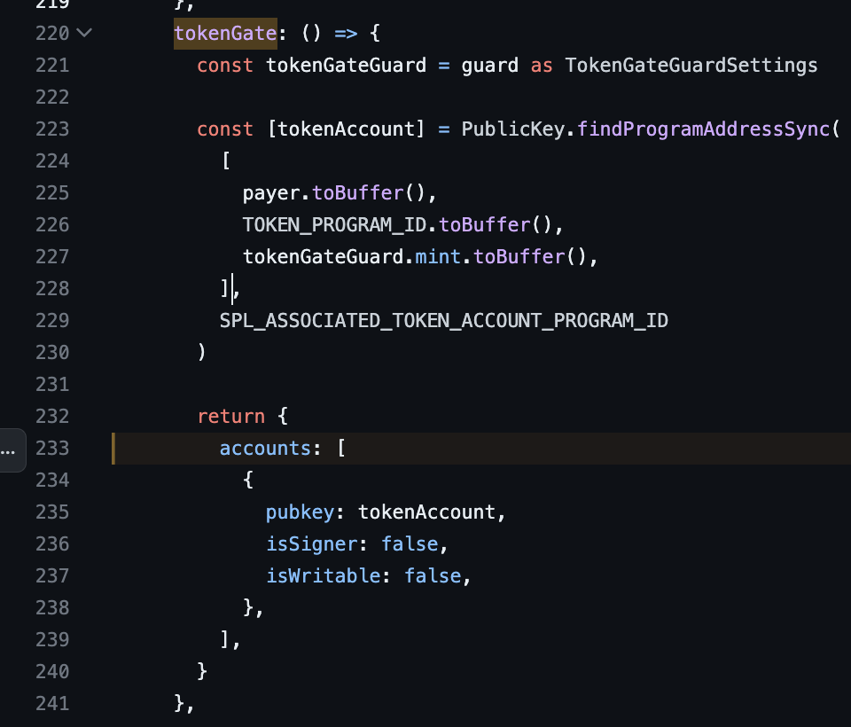

To setup a Candy Machine:

- Create your Candy Machine using [Sugar](https://docs.metaplex.com/programs/candy-machine/how-to-guides/my-first-candy-machine-part1) (now supports pNFTs)
- Change token standard to pNFT: `sugar config set -t pnft` (optional)
- Make sure you have setup your [Candy Guard](https://docs.metaplex.com/programs/candy-machine/how-to-guides/my-first-candy-machine-part1#candy-guards---further-configuration). _This is a necessary step._

After these, you can use this UI to mint pNFTs.

## Candy Guards supported

- [Start date](https://docs.metaplex.com/programs/candy-machine/available-guards/start-date)
- [Sol Payment](https://docs.metaplex.com/programs/candy-machine/available-guards/sol-payment)
- [Allow List](https://docs.metaplex.com/programs/candy-machine/available-guards/allow-list)
  - Grab your Merkle Root from [here](https://tools.key-strokes.com/merkle-root)
  - Add the Merkle Root to your Sugar config.json:
    ```
        "allowList": {
            "merkleRoot": "e889dfa8fbfb6016378348ca395f243c55a0768647c2ca58e5febffa17e02d60"
        },
    ```
  - Add your allow list wallets to the `allowlist.json` file
- [Mint Limit](https://docs.metaplex.com/programs/candy-machine/available-guards/mint-limit)
- [Token Burn](https://docs.metaplex.com/programs/candy-machine/available-guards/token-burn)
- [Token Gate](https://docs.metaplex.com/programs/candy-machine/available-guards/token-gate)
- Any other default Guard. Send a message on the [Metaplex Discord](https://discord.com/channels/848060988636921856/1121915891370709013) to ask for an additional guard

## develop locally

- `yarn`

- Copy and fill the contents from the `.env.template` file into a `.env` file.

- `yarn dev`

## deploy

You can deploy to any provider but make sure you add the `NEXT_PUBLIC_CANDY_MACHINE_ID` environment variable. (_Try [Vercel](https://vercel.com/new)_)

## contribute

You can build guards, or improve the UI, and your PR will be happily reviewed & merged.

Also, I'm accepting tips in SOL to keep improving this open-source project: 52zEuaG5VBQTzRP7MLMyEzSuKgYPF9E9dtaWrmXaiNkg

### adding your own guards

1. Follow [this Link](https://github.com/metaplex-foundation/mpl-candy-guard/tree/c8b52c7ea090d88dc1030df9613a88097ad2b912/js/test/guards), find the test file of the guard you want to add, and check the necessary 'remaining accounts'.

- For example, the TokenPayment needs two 'remaining accounts', as seen [here](https://github.com/metaplex-foundation/mpl-candy-guard/blob/c8b52c7ea090d88dc1030df9613a88097ad2b912/js/test/guards/token-payment.test.ts#L85)

2. Add your new guard to the [mint helper](https://github.com/eliagoris/pnfts-mint/blob/main/utils/mintV2.ts), by adding a new function handler with the name of your guard, following the same pattern as the other guards.
   
   (this image shows the `tokenGate` handler, that returns one 'remaining account')
3. Add the 'remaining accounts' necessary for your guard to work. Check the other guards to see how it is done.

4. You're good to go, no additional steps are necessary.
